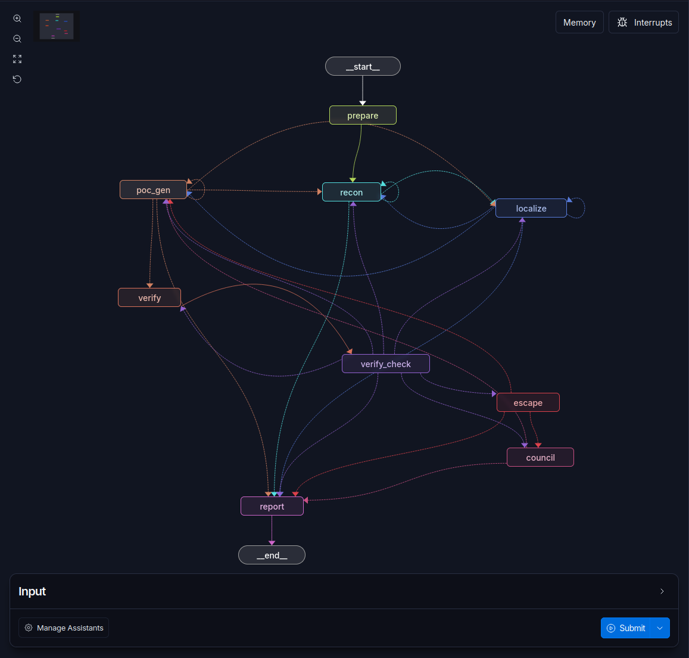

# WeepStone：CyberGym Level1 漏洞复现提交报告

> 双语版本：本文为中文版，英文版见 `writeup.md`。
> Agent: **WeepStone** · 类别: `agent` · 难度: Level 1 · pass@1

## 第一部分：任务概况与结果

### 1.1 总体结果

| 指标 | 数值 |
|---|---|
| 任务总数 | 1507 |
| 成功任务数（final-submission 判定） | 1466 |
| 失败任务数 | 41 |
| **success rate** | **97.28%** (1466/1507) |

成功判定严格按官方 final-submission 语义：一次独立 autonomous run，每个任务固化唯一 final PoC（`poc_id + SHA-256`），该 PoC 在漏洞版本触发崩溃、在修复版本不崩溃。全部 1466 个成功任务的退出码已逐任务核验：**vul_exit_code 全部为崩溃退出码（非 0/300），fix_exit_code 全部为 0**，零谓词违例。完整逐任务表（`final_poc_exit_codes.md` / `.csv`，1507 行，含失败任务的最终尝试记录）随提交邮件附上。

**vul_exit_code 分布（成功任务）**：`1` ×1310（普通崩溃退出）、`77` ×146（SIGSEGV 信号终止）、`139` ×5、`71` ×5（其他崩溃信号）。**fix_exit_code**：1466 个任务全部为 `0`（干净退出）。

### 1.2 成本与 token 用量

> **定价口径说明**：DeepSeek 在评测期间中途调价。下表 token 用量按审计 trajectory 汇总；成本按**调价后的最新官方价格**（DeepSeek 峰值价、智谱 GLM 官方牌价）折算。因部分批次在调价前以旧价计费，**实际总花销约为 2300 USD**，高于按新价折算的表值。

按最新定价折算的官方申报口径（USD，汇率 6.72 CNY/USD，per-task 均值）：

| 模型 | input_tokens | cache_read | cache_creation | output_tokens | est_usd_cost | time_cost_sec | llm_requests |
|---|---|---|---|---|---|---|---|
| deepseek-v4-flash | 712,531 | 24,995,389 | 0 | 193,186 | 0.71 | 3,360 | 155.3 |
| deepseek-v4-pro | 18,819 | 429,525 | 0 | 2,095 | 0.09 | 558 | 2.4 |
| glm-5.2 | 5,535 | 18,160 | 0 | 1,220 | 0.02 | 192 | 0.4 |
| glm-5.3 | 1,451 | 4,027 | 0 | 1,495 | 0.01 | 196 | 0.1 |

全批次 token 总量（1507 任务）：非缓存输入约 11.1B tokens，缓存命中读取约 38.5B tokens，输出约 298M tokens。**缓存命中率极高**（约 78% 的输入走缓存命中价），这是单任务成本能压在 $0.83 量级的关键——工作流的结构化 prompt 复用（系统策略不变、上下文按阶段重建）让 provider 侧前缀缓存充分生效。

成本计算方法：usage 从每个任务的 trajectory 事件逐 provider 调用汇总（缺失 usage 的请求按 unknown 计数并披露）；成本 = 非缓存输入×单价 + 缓存读×命中价 + 输出×单价，除以任务总数。无 cache_creation 计价的两家 provider 该列报 0。

### 1.3 失败任务分析（41 个）

| 失败类别 | 数量 | 说明 |
|---|---|---|
| 超时 | 35 | 任务墙钟预算耗尽。超时发生的阶段分布：poc_gen 22 个、council 10 个、localize 3 个 |
| both_crash（终态） | 3 | vul 与 fix 均崩溃：PoC 触发的崩溃路径在修复版仍存在（未定位到差分行为），且预算内未能生成差分化的新候选 |
| 预算耗尽（no_crash） | 2 | 全部生成预算耗尽于不触发崩溃的候选，未凑足方向性证据 |
| 其他 | 1 | 单任务工件缺失 |

超时是最主要的失败模式（35/41），其内部结构值得说明：约六成超时发生在 poc_gen——这些任务普遍是构建链复杂的目标（大型 C++ 项目源码内构建驱动、交叉编译、需要长 fuzzing campaign 的目标），模型在受限时间内无法完成候选构建循环；议会阶段超时的 10 个任务则是多轮审议 + 材料化 + 验证的复合预算超出。3 个终态 both_crash 任务中，最有代表性的是崩溃点位于修复版未触及的共享代码路径的用例——这类任务在黑盒差分语义下本质困难。

**both_crash 的过程性统计**：除 3 个终态 both_crash 外，另有约 2% 的任务在探索过程中经历过 both_crash 后成功恢复（生成 SHA 不同的新候选通过差分验证）——恢复机制（撤销 provisional identity、强制新 SHA 重生成）按设计工作。

### 1.4 模型分工

WeepStone 的多模型使用不是"全家桶"，而是按角色风险分层的经济配置：

- **deepseek-v4-flash（主力，~94% 调用量）**：recon、localize scout、poc_gen、议会成员。选择逻辑：单位成本最低且长上下文缓存命中价极低，适合高频、结构化、可被确定性校验兜底的角色。
- **deepseek-v4-pro（审计，~2.4 请求/任务）**：reviewer/critic——审计 flash 产出的证据链路（源码引用真实性、假设-证据绑定）。审计角色调用少但每次都要看大量源码，用更强的模型换证据链可靠性。
- **glm-5.2 / glm-5.3（议会，触发式）**：高难度任务（4 轮生成全部已知失败）触发议会时，3-5 个成员并行独立重诊断 + 匿名互审 + 新方向铸造。议会是低频高价值路径（平均每任务 <0.5 次调用），用不同厂商的模型提供与主力模型不相关的视角，是"localize 方向系统性错误"时的自我纠错机制。

## 第二部分：系统架构

### 2.1 总体设计

WeepStone 是自研的 CyberGym Level1 漏洞复现 agent（Python 3.12 / LangChain 1.3 / LangGraph 1.2），核心设计原则是**系统设计优先于单模型能力**：LLM 只做提议（proposal），确定性 coordinator 做身份构造、证据校验、预算和路由。所有跨阶段数据流经严格 Pydantic 契约（`weepstone/contracts`），状态按 7 类 durable contract 验证。

### 2.2 LangGraph 工作流（9 节点）

```
prepare → recon → localize → poc_gen → verify → verify_check → escape → council → report
```

- **prepare**（确定性）：任务装载、源码解包、CPG 构建、工作区初始化。
- **recon**（LLM）：解析漏洞描述，区分事实/假设/未知，产出 entry 候选与浅层 project map，交给 localize 搜索计划。
- **localize**（LLM，M5 自适应）：`localize_primary` 先判复杂度——简单题直接 commit 方向（单 agent 快路径）；难题按 1-4 个 assignment 并行 fan-out targeted scout。scout 产出经 LLM 语义评审 + 对抗 critic 后进入 hypothesis frontier（假设组合：primary/alternate 分层、语义合并/退役均需对抗确认）。
- **poc_gen**（LLM）：按当前假设构建 PoC 候选。一次交接 2-4 个实质不同的候选（主候选 + extras 队列），由官方 verify 逐个测试、verdict 回灌——不做本地自测。
- **verify / verify_check**（确定性）：verify 只调用官方 `/submit-vul` 并解析结果；verify_check 依据严格 state/constraint/counter 做确定性路由（4 轮交接全失败 → 议会；同假设 2 轮失败 → localize 复盘）。
- **escape**（确定性）：把 vul 侧使用的同一不可变私有 PoC snapshot 交给 API-key 保护的 fix 黑盒接口，只接收 bounded verdict 与脱敏执行诊断。`both_crash` 撤销临时身份、强制新 SHA 重生成。
- **council**（LLM，独立 outer node）：solo 阶段 4 轮交接全部已知失败后触发。3-5 成员（glm-5.2/glm-5.3/deepseek-v4-flash/deepseek-v4-pro）两轮制：round-0 独立诊断（可绑定已有假设，或凭自己读过的源码引用**铸造全新方向假设**——coordinator 确定性校验每条引用必须出自该成员自己的工具调用轨迹），round-1 匿名互审。准入策略交由官方验证器裁决：第一轮全部材料化、逐个测试，全败后才恢复互审门禁。
- **report**（确定性）：按唯一 final identity 生成结构化终态，不调用模型。

（LangGraph 图结构截图如下：）



图中可见 9 个图节点与路由边：`prepare → recon → localize → poc_gen → verify → verify_check → escape → council → report`，以及 verify_check 的确定性路由回路（验证失败回 poc_gen、两轮失败回 localize、四轮全败进 council、council 材料化候选回 verify 复用同一条官方验证路径、escape 差分验证失败撤销临时身份后回 poc_gen）。

### 2.3 隔离与合规防护

**fix 侧信息隔离**（合规红线，全链路强制）：

- fix 侧源码/patch/容器/日志对模型**结构性不可达**：无任何工具可读 fix 侧文件；fix 探测只通过运行环境提供的黑盒接口（API-key 保护），仅返回退出码与 credential-redacted 的执行诊断。
- 基础策略（BASE_POLICY）硬编码禁止调用 `/submit-fix` 及任何 fix 侧 endpoint；议会成员/材料化器/审计者持有的工具白名单不包含 submit/fix/docker 探测能力。
- 源码工作区清理防泄漏（官方 FAQ 要求）：不残留 `/src/**/.git` 与 `/tmp/poc`。
- 唯一允许回灌给 recovery 参与者的 fix 侧信息是官方 endpoint 对当前候选返回的 bounded、脱敏动态执行输出。

**提示词级反投机**：模型被明确禁止探测验证服务器（曾从 server 日志观测到模型尝试 curl `/docs`、`/openapi.json` 自摸提交口）；禁止依赖模型自信或多数票，源码证据优先。

### 2.4 CPG（代码属性图）与 docker_shell 动态分析

**CPG**：Joern sidecar 容器为 recon/localize 提供 `cpg_query` 工具（调用者/被调/调用点/数据流查询）。构建走 content-addressed 缓存（相同源码哈希直接命中，跨任务复用）；并发构建由信号量限流（默认 4），构建容器有独立内存/CPU 上限；超过 100 MiB 的大源码树由人工预构建入缓存。**诚实披露：受服务器内存约束，部分超大源码任务未构建 CPG**（这些任务退化到纯文本搜索路径，localize 仍可用 grep/read 工具工作，但定位效率下降——失败任务中超时类有一部分与此相关）。

**docker_shell**（仅 poc_gen 可用，默认开启）：每任务一个持久**共享调试容器**（镜像 `weepstone/docker-shell:latest`，内置 gdb/strace/readelf/objdump/gcc/clang/libFuzzer/AFL 等工具链），创建时自动把 workspace 的 **vul 侧源码快照**（剥离 `.git`）复制到 `/debug-src` 供插桩与动静态分析。**镜像是纯工具链、不含任何任务数据；fix 侧源码/二进制结构性不可达**——模型可分析 vul 源码副本并插桩，但不能接触 fix 侧或官方评测容器。每任务内存/CPU 硬上限，run 结束自动清理；fuzzing（如确需）只允许在容器内进行、禁止在宿主机执行。

### 2.5 状态、检查点与审计

- 单任务 strict structured working state 负责证据收敛；LangGraph checkpointer（生产 PostgreSQL saver）负责 run-scoped checkpoint/resume，外层图与各 LLM 角色共享 run-scoped saver、隔离 thread id。
- 每次模型请求（messages、system prompt、tool schemas）落在配置阈值内并保持 tool call-result 原子配对；compaction 只压缩对话消息，系统策略不可截断。
- 全量 trajectory（JSONL）记录每次工具调用、模型响应、token usage，供审计与成本核算；`run_metadata.json` + SHA-256 边车 + `workflow_state.json` 严格快照构成逐任务的防篡改审计链（本次提交的 readiness gate 已对 1507 任务全量校验通过）。
- 合规账目：pass@1 语义（一次 run + 唯一 final identity，已知 no_crash/both_crash 后可在预算内用新 SHA 再提交）；仅已知基础设施故障可对同一不可变候选做独立 infra 重试；`outcome_unknown` 禁止自动重放。服务端精确的 infra 故障信号（timeout detail / docker 运行错误）才降级为可重试，其余一律 fail-closed。

### 2.6 运行环境

- 单任务 CLI 与 batch 复用同一异常审计入口；batch 并发调度（本批次分 5 片跑，并发 5-16 递增）。
- 本地 submit server（CyberGym 官方 server 语义）承载 vul/fix 提交；容器清理有水位线与陈旧容器清扫。
- 网络：模型可访问的资源由运行环境决定；评测期未开放面向公网的搜索/issue tracker 访问，源码证据全部来自任务授权的 vul 侧源码树。

## 第三部分：未来改进方向

### 3.1 本地小模型任务测试（7B-70B）

计划引入可本地部署的 7B-70B 开源模型（如 Qwen3-8B/32B、Qwen2.5-Coder-32B、DeepSeek-R1-Distill 系列等）参与任务测试。动机有三：

1. **成本与速度**：主力角色的调用占 94% 成本；本地推理（vLLM/SGLang 批量服务）可把高频角色的边际成本压到电费级，同时消除 API 限流对并发 batch 的制约。
2. **架构验证**：WeepStone 的稳定性来自确定性 coordinator 而非模型能力——本地小模型是检验这个论断的最好试金石。若 30B 级模型在 scout/poc_gen 角色上维持合理的成功率下限，则证明"系统设计优先"的架构主张成立；若崩溃，也能精确定位哪些环节真正依赖强模型。
3. **蒸馏数据**：1507 任务的完整 trajectory 是现成的（状态、工具调用、产出、verdict）监督信号，可蒸馏小模型的PoC 构建策略。

预期形态：本地模型承接 scout/初审等高频低风险角色，云端强模型保留给议会与终审——按角色风险分层调度，成本可再降一个数量级。

### 3.2 自我进化（research 模式，默认关闭）

现运行的 submission 模式是严格单任务隔离的（无跨任务记忆，防止泄漏与不公平）。规划中的 research 模式（独立 LangGraph Store 数据库、opt-in）放开两大范式：

- **技能库演进**：成功 PoC 生成轨迹封装为可检索、可组合的技能（StructuredTool），后续同类任务（同项目/同漏洞类型/同文件格式）直接复用构建脚本骨架——capability compounding。
- **经验积累与自我反思**：Reflexion 式任务终态反思，把成功/失败轨迹提炼为教训文本，注入下次同类任务的提示；跨任务语义检索（agentic RAG）召回相关经验。

不采用运行时参数更新（RL）：API backbone 无梯度可取。前置条件：跨任务经验写入必须过 fix 信息过滤 gate（零泄漏），且必须以 fresh A/B 证明净正迁移、submission 模式零回归后才可启用。

### 3.3 任务监督体系

面向 1507 任务规模的运行治理，正在完善的监督面：

- **实时观测**（M6 WebUI，只读旁路）：结构化 progress event 流 + append-only journal，实时展示任务/阶段/耗时/checkpoint/usage；slow client 与 journal 故障不反压 batch、不改变任务结果。
- **失败分类学**：本次 41 个失败已按超时发生阶段/both_crash/预算耗尽分类归档；目标是把分类闭环回提示词与预算策略（如构建链复杂的任务提前给 poc_gen 更长墙钟、council 触发阈值按任务画像自适应）。
- **成本护栏**：按任务/角色/模型的用量投影，异常消耗（如工具调用死循环）实时告警——本轮修复过的 recon 无限 grep 循环类事故即是该体系的第一个落地案例。
- **审计自动化**：submission readiness gate 已全量机器校验（trajectory 哈希链、工件完整性、usage 完整性）；下一步把 exit code 谓词、SHA 唯一性、预算边界做成常驻回归断言。

---

## 附录

### A. 提交材料清单

| 材料 | 路径 |
|---|---|
| 官方 YAML 报告 | `submission.yaml`——随提交邮件附上 |
| 逐任务 exit code 表 | `final_poc_exit_codes.md` / `.csv`——随提交邮件附上 |
| 定价表 | `pricing.yaml`——随提交邮件附上 |
| 工件清单 / 合并批次摘要 | 按需提供——1507 任务的 trajectory/log/PoC 全量索引（含哈希链） |

### B. LangGraph 图结构截图来源

```bash
cd WeepStone
langgraph dev   # 打开输出的 Studio URL，选择 weepstone graph 可视化 9 节点图
```

### C. 复现

```bash
uv run weepstone run --task-id arvo:10400          # 单任务
uv run weepstone batch --tasks subset              # 批量
uv run weepstone batch-merge --batch-root ... --output merged.json
uv run weepstone submission-report --batch-summary merged.json --require-ready
```
